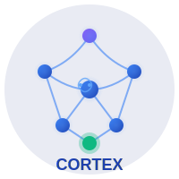
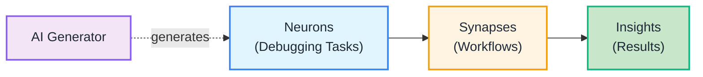
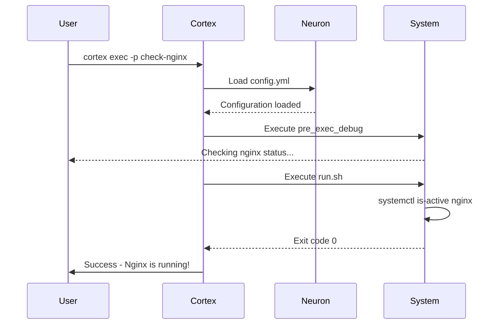
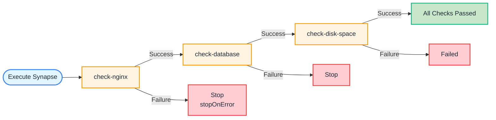
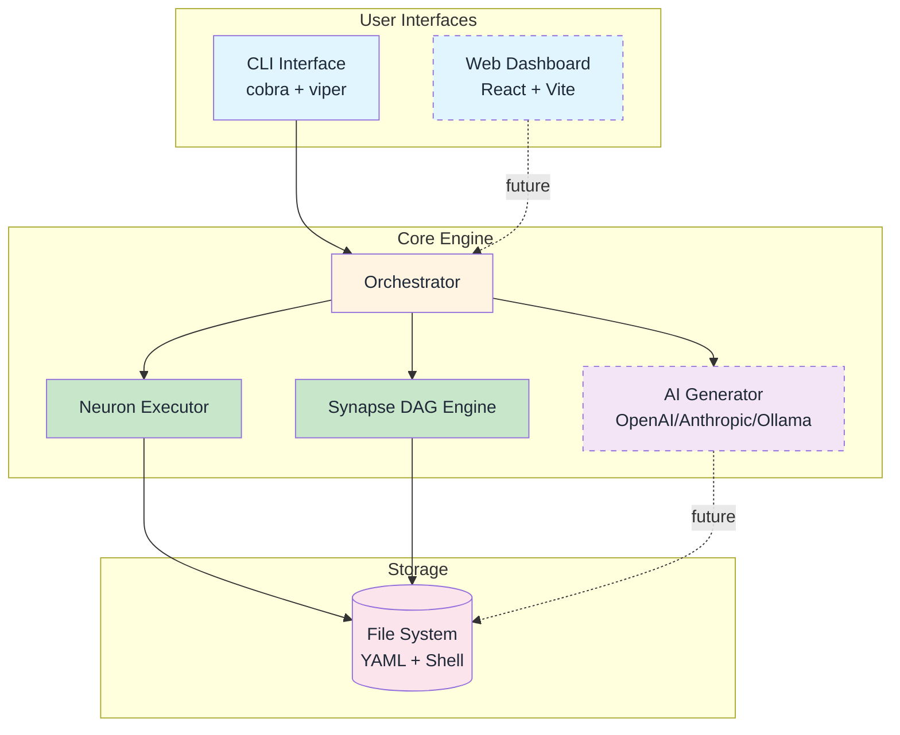
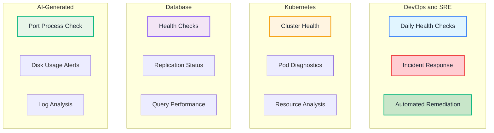
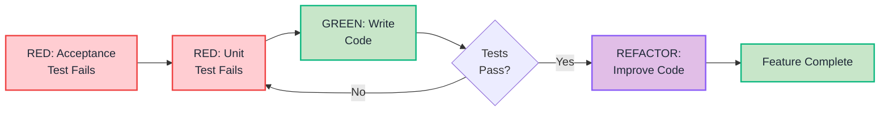

<p align="center">
  
</p>

<h1 align="center">Cortex</h1>

<p align="center">
  <strong>🧠 AI-powered infrastructure debugging orchestrator</strong><br>
  Organize, automate, and share debugging workflows with ease
</p>

<p align="center">
  <a href="#quick-start">Quick Start</a> •
  <a href="#features">Features</a> •
  <a href="#architecture">Architecture</a> •
  <a href="#documentation">Documentation</a> •
  <a href="#contributing">Contributing</a>
</p>

<p align="center">
  
  
  
  
</p>

---

## What is Cortex?

Cortex helps teams organize debugging knowledge into reusable components called **neurons** (discrete tasks) and chain them into automated **synapses** (workflows). Think of it as bringing structure and science to the art of infrastructure debugging.

### Visual Overview



### Key Benefits

- 🧠 **Knowledge Organization**: Turn debugging scripts into reusable neurons
- 🔗 **Workflow Automation**: Chain neurons into powerful synapses
- 🤖 **AI-Powered**: Generate debugging scripts from natural language (coming soon)
- 📊 **Visual Insights**: Modern web UI with real-time execution tracking (coming soon)
- 🚀 **Deploy Anywhere**: Single 50MB binary OR Kubernetes cluster

## Features

- ✅ **Neuron Execution**: Run discrete debugging tasks with structured output
- ✅ **Synapse Orchestration**: Chain neurons in sequential or parallel workflows
- ✅ **CLI Interface**: Powerful command-line tool with intuitive commands
- 🚧 **AI Generation**: Generate neurons from natural language (OpenAI, Anthropic, Ollama)
- 🚧 **Web Dashboard**: Real-time monitoring with WebSocket streaming
- 🚧 **Visual Builder**: Drag-and-drop synapse creation
- 📋 **Fleet Management**: Monitor distributed edge devices
- 📋 **Plugin System**: Extend functionality with custom plugins

## Quick Start

### Installation

```bash
# Clone the repository
git clone https://github.com/anoop2811/cortex.git
cd cortex

# Build the binary
make build

# Verify installation
./cortex --version
```

### Your First Neuron

A **neuron** is a discrete debugging task (shell script + config).

```bash
# Create a neuron
cortex create-neuron check-nginx

# This creates:
# check-nginx/
# ├── config.yml
# └── run.sh
```

**How it works:**



Edit `check-nginx/config.yml`:
```yaml
---
name: check_nginx
type: check
description: "Check if nginx is running"
exec_file: run.sh
pre_exec_debug: "Checking nginx status..."
post_exec_success_debug: "Nginx is running!"
```

Edit `check-nginx/run.sh`:
```bash
#!/bin/bash
systemctl is-active nginx
```

Execute:
```bash
cortex exec -p check-nginx
```

### Your First Synapse

A **synapse** is a workflow that chains multiple neurons.

```bash
# Create a synapse
cortex create-synapse health-check
```

Configure `health-check/config.yml`:
```yaml
---
name: health-check
description: "Complete system health check"
neurons:
  - check-nginx
  - check-database
  - check-disk-space
execution: sequential  # or parallel
stopOnError: true
```

Execute:
```bash
cortex exec -p health-check
```

**Synapse Execution Flow:**



## Architecture

**High-Level System Design:**



> 📘 **See detailed diagrams**: [Architecture Diagrams](docs/diagrams/architecture.md)

### Core Concepts

1. **Neurons**: Discrete debugging tasks (shell scripts with metadata)
2. **Synapses**: Workflows that chain neurons in DAGs
3. **Execution**: Sequential or parallel neuron execution
4. **AI Generation**: Generate neurons from natural language (coming soon)

See [Architecture Documentation](docs/architecture/overview.md) for details.

## Documentation

📚 **[Complete Documentation](docs/README.md)**

### For Users
- **[Getting Started Guide](docs/guides/getting-started.md)** - Install and run your first neuron
- **[User Guide](docs/guides/user-guide.md)** - Complete feature documentation (coming soon)

### For Contributors
- **[Contributing Guide](docs/guides/contributing.md)** - How to contribute
- **[Testing Guide](docs/TESTING.md)** - TDD workflow with Ginkgo and Playwright
- **[Architecture Docs](docs/architecture/)** - System design and components

### Technical Specs
- **[AI Neuron Generation](docs/architecture/ai-neuron-generation.md)** - AI feature design
- **[Web UI Specification](docs/architecture/web-ui.md)** - Web interface design
- **[Dependencies](docs/DEPENDENCIES.md)** - All open source dependencies

## Examples

Check out the [`examples/`](examples/) directory for sample neurons and synapses:

- `system_health_check/` - Basic system diagnostics
- `k8s/k8s_cluster_health/` - Kubernetes cluster health check

## Use Cases

**Common Debugging Workflows:**



### DevOps & SRE

```bash
# Daily health checks
cortex exec -p daily-health-check

# Incident response
cortex exec -p incident-diagnostics

# Automated remediation
cortex exec -p auto-fix-nginx
```

### Kubernetes Debugging

```bash
# Check cluster health
cortex exec -p k8s-cluster-health

# Debug pod issues
cortex exec -p k8s-pod-diagnostics

# Analyze resource usage
cortex exec -p k8s-resource-analysis
```

### AI-Powered Generation (Coming Soon)

```bash
# Solve real debugging problems with natural language
cortex generate-neuron \
  --prompt "Find which process is using port 8080 and show full command with PID" \
  --provider openai

# Complex multi-step diagnostics
cortex generate-neuron \
  --prompt "Check if PostgreSQL is running, accepting connections, and responding to queries" \
  --provider anthropic

# Local generation (no API key needed)
cortex generate-neuron \
  --prompt "Show disk usage for all mounts and alert if any exceeds 80%" \
  --provider ollama
```

## Development

### Prerequisites

- Go 1.25.4+
- Node.js 24.x LTS (for web UI)
- Make

### Setup

```bash
# Install dependencies
make install-deps

# Run tests
make test-all

# Build
make build

# Run in watch mode (TDD)
make watch
```

### Testing

We follow Test-Driven Development (TDD) with outer/inner loops:

```bash
# All tests
make test-all

# Unit tests (inner loop)
make test-unit

# Acceptance tests (outer loop)
make test-acceptance

# Coverage report
make coverage
```

**TDD Workflow:**



See [Testing Guide](docs/TESTING.md) for details.

## Contributing

We welcome contributions! Please see our [Contributing Guide](docs/guides/contributing.md).

### Quick Start for Contributors

```bash
# 1. Fork the repository
# 2. Clone your fork
git clone https://github.com/YOUR-USERNAME/cortex.git

# 3. Create feature branch
git checkout -b feature/my-feature

# 4. Make changes and test
make test-all

# 5. Submit pull request
```

### Ways to Contribute

- 🐛 Report bugs
- 💡 Suggest features
- 📝 Improve documentation
- 🧪 Write tests
- 💻 Submit pull requests
- 🌍 Translate documentation

## Project Status

- **Version**: 1.0 (in development)
- **License**: Apache 2.0
- **Language**: Go 1.25.4
- **Dependencies**: 100% open source

### Roadmap

- ✅ Core neuron/synapse execution
- ✅ CLI interface
- ✅ Test infrastructure (Ginkgo v2 + Playwright)
- 🚧 AI neuron generation (OpenAI, Anthropic, Ollama)
- 🚧 Web UI dashboard (React + Vite)
- 🚧 Visual synapse builder
- 🚧 Kubernetes deployment
- 📋 Fleet management
- 📋 Plugin marketplace

## Technology Stack

- **Backend**: Go 1.25.4, Cobra, Viper, Zerolog
- **Frontend**: React 19, Vite 6, Tailwind CSS 4, TanStack Query
- **Testing**: Ginkgo v2, Gomega, Playwright
- **Deployment**: Docker, Kubernetes, Helm

All dependencies are verified as 100% open source. See [DEPENDENCIES.md](docs/DEPENDENCIES.md).

## Why Cortex?

### The Problem

Debugging infrastructure is often an art, with knowledge scattered across:
- Personal scripts on laptops
- Slack conversations
- Tribal knowledge
- "What did I do 2 weeks ago?"

### The Solution

Cortex brings **science to the art** by:
- Organizing debugging steps into reusable neurons
- Automating workflows with synapses
- Sharing knowledge across teams
- AI-powered script generation (coming soon)

### Design Principles

- **Edge-First**: Run on anything (Raspberry Pi to Kubernetes)
- **Shell-Native**: Embrace existing bash/PowerShell scripts
- **Progressive**: Start simple, add features as needed
- **Privacy-First**: AI is optional, local mode available
- **Open Source**: 100% Apache 2.0, no bait-and-switch

## Security

Cortex takes security seriously. We use automated scanning and follow secure development practices.

- **Security Policy**: See [SECURITY.md](SECURITY.md) for vulnerability reporting
- **Automated Scanning**: Dependabot, CodeQL, Trivy, Gosec
- **Dependency Updates**: Weekly automated security patches

**Found a security issue?** Please report it privately - see [SECURITY.md](SECURITY.md)

## Community

- **GitHub Issues**: [Bug reports and feature requests](https://github.com/anoop2811/cortex/issues)
- **GitHub Discussions**: [Questions and ideas](https://github.com/anoop2811/cortex/discussions)
- **Pull Requests**: [Contribute code](https://github.com/anoop2811/cortex/pulls)

## License

Apache License 2.0 - See [LICENSE](LICENSE) for details.

## Acknowledgments

Built with ❤️ by the Cortex community.

Special thanks to all [contributors](https://github.com/anoop2811/cortex/graphs/contributors).

---

**[Documentation](docs/README.md)** • **[Getting Started](docs/guides/getting-started.md)** • **[Contributing](docs/guides/contributing.md)** • **[Architecture](docs/architecture/overview.md)**
