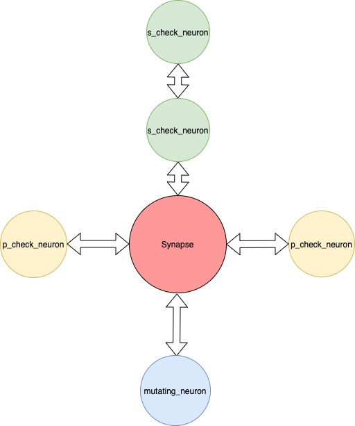

<p>
A simple infrastructure debug orchestrator to bring your thoughts into discrete steps and tie them all together to effectively find or resolve issues.
</p>

# Motivation
We all have nuances in how we debug issues and somehow we tend to think it's an art. The aim with cortex is to bring some science and automation into how we debug infrastructure problems. The main task cortex tries to solve is bring some structure to the art and provide an easier way to mimic your thought process so that it's easier to share with others
and not having to ponder "What did I do 2 weeks ago". The hope with this tool is that it would help the SRE to think in discrete steps that could then be collated, reused and executed in different ways which would help not just in expressing the tasks better, but also become primers for the juniors in the team to learn the different ways to debug.

We understand there are myriad sets of tools already out there and our aim is not build something for posterity, but to use something that was lightweight and easy to use till a better tool arrives. Even with tools like Chef and Ansible being used, a vast majority of debug steps are still just plain shell scripts and our aim was to harness that knowledge and use it a fashion that could bring some order to it.

# How does cortex work?
Cortex works on the following principles:
1. Every action we take can be a discretely identified task through and is called a neuron
2. Every action has an output that could end the debugging session or be passed to the next neuron, or be discarded
3. You could create a plan composing of multiple neurons to be run in parallel or sequence and is called a synapse
4. Each neuron could be fired independently by multiple synapse and needs to handle state accordingly
5. Synapse should make the determination of resolution based on analysis of outputs from the neurons

The architecture is quite simple, and think of synapse building directed acyclic graph of parallel vertices and sequential plans which are then executed in an event loop.



where p_*_neurons are executed in parallel and s_*_neurons in serial

# Quick Start with Docker

```bash
# Build the Docker image
make docker-build

# Run system health check example
docker run --rm -it cortex:latest \
  cortex fire-synapse -p /cortex/example/system_health_check

# Run Kubernetes health check (requires kubectl access)
docker run --rm -it \
  -v ~/.kube:/root/.kube:ro \
  cortex:latest \
  cortex fire-synapse -p /cortex/example/k8s/k8s_cluster_health
```

## Creating neurons
Neurons are folders that contain a run script that can exit with a defined exit code and also contain a configuration yaml named neuron.yaml. A few conventions that would be good to follow:
1. If the neuron script does not mutate anything, by convention, start with "check_" as the prefix. For eg: "check_web_proxy_connection_config".
2. If its a mutating neuron i.e it updates a config or property, use "mutate_" as the prefix. For eg: "mutate_web_proxy_connection_config"

This helps the reader to make quicker decisions on running a harmless synapse vs ones they need to be careful about running in say a production environment. The name of the folder should give enough indication on the activity.

To create a neuron, run 
`cortex create-neuron check_web_proxy_conn_config`
 for more options, run
`cortex create-neuron -h`

It would create a folder and bootstrap files as below:

```
check_web_proxy_conn_config
    |----- neuron.yaml
    |----- run.sh
    |----- run.ps1
```

sample neuron.yaml:

```
---
name: check_web_proxy_conn_config
type: check
description: "A longer description"
exec_file: %s
pre_exec_debug: "Going to check the web_proxy connection configuration"
assertExitStatus: [0, 137]
post_exec_success_debug: "All configurations checkout ok"
post_exec_fail_debug:
  120: "Found maxconn rate to be too low"
  110: "Found maxpipes to be too low"`

```

As you notice, the exit code has a lot of importance in how your neurons propogate the debugging to the next step within the synapse.

## Creating synapse

To create a synapse, run:
`cortex create-synapse app_network_latency`
This would create a folder with the following bootstrap files:

```
app_network_latency
     |------ synapse.yaml     
```
For more options, run:
`cortex create-synapse -h`

To add a neuron to the synapse to be planned in sequence, run:

`cortex add-neuron --synapse app_network_latency --neuron /usr/neurons/check_web_proxy_conn_config --sequence`

and to add the same to be run in parallel:

`cortex add-neuron --synapse app_network_latency --neuron /usr/neurons/check_web_proxy_conn_config --parallel`

For more options, run:
`cortex add-neuron -h`

A sample synapse yaml when you want to fix something on occurrence of an error:

```
---
name: app_network_latency
definition:
  - neuron: check_web_proxy_conn_config
    config:
      path: /usr/neurons/check_web_proxy_conn_config
      fix:
        - 120: mutate_web_proxy_conn_bump_maxconn_config
        - 110: mutate_web_proxy_conn_bump_maxpipes_config
  - neuron: check_api_gateway_conn_config
    config:
      path: /usr/neurons/check_web_proxy_conn_config
      fix:
        - 120: mutate_api_gateway_conn_bump_maxconn_config
        - 110: mutate_api_gateway_conn_bump_maxpipes_config
  - neuron: mutate_web_proxy_conn_bump_maxconn_config
    config:
    path: /usr/neurons/mutate_web_proxy_conn_bump_maxconn_config
 plan:
  config:
    - exit_on_first_error: false    
  steps:
    serial
      - check_api_gateway_conn_config
      - check_web_proxy_cpu_usage
      - check_grafana_cpu_trend
    
```

A synapse that only checks and does not mutate:               

```
---
name: app_network_latency
definition:
  - neuron: check_web_proxy_conn_config
    config:
      path: /usr/neurons/check_web_proxy_conn_config
  - neuron: check_api_gateway_conn_config
    config:
      path: /usr/neurons/check_web_proxy_conn_config
 plan:
    config:
      - exit_on_first_error: false
    steps:
      serial
        - check_web_proxy_conn_config
        - check_api_gateway_conn_config 
```

A synapse that that runs the checks in parallel:               
    
```
---
name: app_network_latency
 - definition:
     - neuron: check_web_proxy_conn_config
       config:
         path: /usr/neurons/check_web_proxy_conn_config
         fix:
          - 120: mutate_web_proxy_conn_bump_maxconn_config
          - 110: mutate_web_proxy_conn_bump_maxpipes_config
     - neuron: check_api_gateway_conn_config
       config:
         path: /usr/neurons/check_web_proxy_conn_config
         fix:
          - 120: mutate_api_gateway_conn_bump_maxconn_config
          - 110: mutate_api_gateway_conn_bump_maxpipes_config
    - neuron: mutate_web_proxy_conn_bump_maxconn_config
      config:
 plan:
   - config:
     - exit_on_first_error: false
   - parallel
     - check_web_proxy_conn_config
     - check_api_gateway_conn_config
     - check_web_proxy_cpu_usage
     - check_grafana_cpu_trend
```
