# Cortex Architecture Diagrams

Visual representations of Cortex's architecture and workflows.

## System Architecture

## Neuron Execution Flow

## Synapse Workflow (Sequential)

## AI Neuron Generation Flow

## TDD Workflow (Outer + Inner Loop)

```mermaid
flowchart TD
    subgraph "Outer Loop - Acceptance Tests"
        AcceptanceRed[🔴 Write Failing<br/>Acceptance Test<br/>Ginkgo/Playwright]
        AcceptanceGreen[🟢 Acceptance Test<br/>Passes]
    end

    subgraph "Inner Loop - Unit Tests"
        UnitRed[🔴 Write Failing<br/>Unit Test<br/>Ginkgo/Gomega]
        Implementation[🟢 Write Minimal<br/>Implementation]
        UnitGreen[🟢 Unit Test<br/>Passes]
        Refactor[♻️ Refactor<br/>Improve code]
    end

    AcceptanceRed --> UnitRed
    UnitRed --> Implementation
    Implementation --> UnitGreen
    UnitGreen --> TestAcceptance{Acceptance<br/>passes?}

    TestAcceptance -->|No| UnitRed
    TestAcceptance -->|Yes| AcceptanceGreen

    AcceptanceGreen --> Refactor
    Refactor --> Done([✅ Feature Complete])

    style AcceptanceRed fill:#ffcdd2,color:#1f2937
    style UnitRed fill:#ffcdd2,color:#1f2937
    style Implementation fill:#fff9c4,color:#1f2937
    style UnitGreen fill:#c8e6c9,color:#1f2937
    style AcceptanceGreen fill:#c8e6c9,color:#1f2937
    style Refactor fill:#e1bee7,color:#1f2937
    style Done fill:#c8e6c9,color:#1f2937
```

## Deployment Models

## Neuron File Structure

## Security Scanning Pipeline

```mermaid
flowchart TD
    subgraph "Triggers"
        Push[Git Push]
        PR[Pull Request]
        Schedule[Daily Schedule<br/>2 AM UTC]
    end

    subgraph "Go Security"
        GoVuln[govulncheck<br/>Go vulnerabilities]
        Gosec[gosec<br/>Security issues]
        GoMod[go mod verify<br/>Module integrity]
    end

    subgraph "npm Security"
        NpmAudit[npm audit<br/>npm vulnerabilities]
    end

    subgraph "Code Analysis"
        CodeQL[CodeQL<br/>Semantic analysis]
        Trivy[Trivy<br/>Container/FS scan]
    end

    subgraph "Results"
        SARIF[Upload SARIF<br/>to Security tab]
        Artifacts[Upload artifacts<br/>for review]
        Block{Block<br/>on critical?}
    end

    Push --> GoVuln
    PR --> GoVuln
    Schedule --> GoVuln

    GoVuln --> GoMod
    GoVuln --> Gosec
    GoVuln --> NpmAudit
    GoVuln --> CodeQL
    GoVuln --> Trivy

    Gosec --> SARIF
    CodeQL --> SARIF
    Trivy --> SARIF
    NpmAudit --> Artifacts

    SARIF --> Block
    Block -->|Critical| Fail[❌ Block PR/Push]
    Block -->|Lower| Pass[✅ Allow with warning]

    style Push fill:#e1f5ff,color:#1f2937
    style PR fill:#e1f5ff,color:#1f2937
    style Schedule fill:#e1f5ff,color:#1f2937
    style GoVuln fill:#c8e6c9,color:#1f2937
    style CodeQL fill:#fff4e1,color:#1f2937
    style SARIF fill:#f3e5f5,color:#1f2937
    style Fail fill:#ffcdd2,color:#1f2937
    style Pass fill:#c8e6c9,color:#1f2937
```

